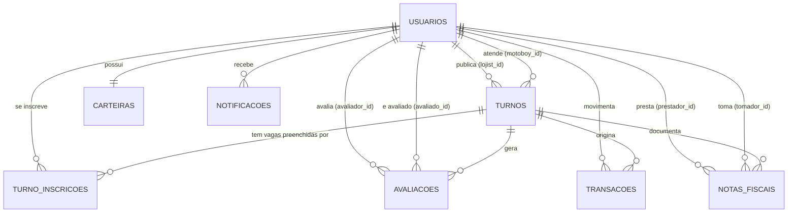

# DER — Diagrama Entidade-Relacionamento

Mapa das tabelas que compõem o banco de dados do **MotoShift**. O modelo reflete o schema real em produção (PostgreSQL no Railway), versionado por **Flyway** (migrações V1 a V11) e validado contra as entidades JPA do backend Spring Boot (`spring.jpa.hibernate.ddl-auto=validate`).

> **Escopo:** 8 tabelas — `usuarios`, `turnos`, `turno_inscricoes`, `avaliacoes`, `carteiras`, `transacoes`, `notificacoes`, `notas_fiscais`.
> Fonte da verdade: `backend/src/main/resources/db/migration` + `backend/src/main/java/com/motoshift/entity`.
> O diagrama em imagem (`der_motoshift.png`) é gerado a partir de `der_motoshift.mmd`; regenere-o quando o `.mmd` mudar.

## Diagrama

> Anexar aqui a imagem `der_motoshift.png`

Código-fonte do diagrama (Mermaid): `der_motoshift.mmd`, resumido abaixo.

## Visão geral das entidades

| Tabela | Representa | Chave primária | Restrições de unicidade |
|---|---|---|---|
| `usuarios` | Lojista ou motoboy — um único cadastro, diferenciado pelo campo `tipo` | `id` | `email` |
| `turnos` | Turno de entrega publicado pelo lojista (janela de horário, valor e local) | `id` | — |
| `turno_inscricoes` | Inscrição de um motoboy em um turno — permite turno com várias vagas | `id` | `uk_turno_motoboy (turno_id, motoboy_id)` |
| `avaliacoes` | Nota recíproca entre lojista e motoboy ao fim do turno | `id` | `uk_avaliacao (turno_id, avaliador_id, avaliado_id)` |
| `carteiras` | Saldo do usuário na plataforma: disponível + bloqueado | `id` | `usuario_id` |
| `transacoes` | Extrato — todo movimento de dinheiro gera um lançamento | `id` | `idempotency_key` |
| `notificacoes` | Notificação in-app do usuário (SCRUM-20) | `id` | — |
| `notas_fiscais` | NFS-e do serviço prestado num turno — uma por par (turno, entregador) | `id` | `uk_nota_turno_prestador (turno_id, prestador_id)` |

## Relacionamentos e cardinalidades

| Origem | Destino | Cardinalidade | Regra de negócio |
|---|---|---|---|
| `usuarios` | `turnos.lojist_id` | 1 : N | Um lojista publica vários turnos; todo turno tem exatamente um lojista |
| `usuarios` | `turnos.motoboy_id` | 0..1 : N | Aponta para o primeiro entregador inscrito; nulo enquanto o turno está aberto |
| `turnos` | `turno_inscricoes` | 1 : N | Uma inscrição por vaga preenchida, limitada pelo campo `vagas` |
| `usuarios` | `turno_inscricoes.motoboy_id` | 1 : N | Um motoboy se inscreve em vários turnos, mas só uma vez no mesmo turno |
| `turnos` | `avaliacoes` | 1 : N | Cada turno gera até 2 avaliações por par lojista/entregador |
| `usuarios` | `avaliacoes.avaliador_id / avaliado_id` | 1 : N (duplo) | Auto-relacionamento: o mesmo usuário avalia e é avaliado |
| `usuarios` | `carteiras` | 1 : 1 | Toda carteira tem um dono único — lojista ou entregador |
| `usuarios` | `transacoes.usuario_id` | 1 : N | Dono do lançamento; `contraparte_id` é o outro lado quando existe |
| `turnos` | `transacoes.turno_id` | 0..1 : N | Nulo em recarga, saque e bônus (operações de uma ponta só) |
| `usuarios` | `notificacoes` | 1 : N | `referencia_tipo` + `referencia_id` fazem o deep link e a deduplicação |
| `turnos` | `notas_fiscais` | 1 : N | Uma nota por entregador do turno: três vagas, três notas |
| `usuarios` | `notas_fiscais.prestador_id / tomador_id` | 1 : N (duplo) | O entregador presta e o lojista toma; `emitida_por_id` registra quem clicou |

## Dicionário de dados

### usuarios

| Coluna | Tipo | Nulo | Observação |
|---|---|---|---|
| `id` | BIGINT | não | PK, IDENTITY |
| `nome` | VARCHAR(255) | não | — |
| `email` | VARCHAR(255) | não | UNIQUE — usado como login |
| `senha` | VARCHAR(255) | não | Hash BCrypt — a V9 converteu as contas antigas que ainda estavam em texto puro |
| `telefone` | VARCHAR(255) | não | — |
| `tipo` | VARCHAR(255) | não | `lojista` \| `motoboy` |
| `documento_federal` | VARCHAR(255) | sim | CPF ou CNPJ |
| `data_nascimento`, `cidade`, `estado`, `foto_perfil` | DATE / VARCHAR | sim | Dados de perfil |
| `score` | FLOAT(53) | não | Default 5.0 |
| `media_avaliacao` | FLOAT(53) | sim | Calculada a partir de `avaliacoes` |
| `nome_fantasia`, `endereco_comercial` | VARCHAR(255) | sim | Preenchidos quando `tipo = lojista` |
| `cnh_numero`, `cnh_categoria`, `cnh_validade` | VARCHAR / DATE | sim | Preenchidos quando `tipo = motoboy` (categoria A ou AB) |
| `veiculo_modelo`, `veiculo_placa`, `veiculo_ano`, `veiculo_cor` | VARCHAR / INTEGER | sim | Dados da moto do entregador |
| `tentativas_login` | INTEGER | não | Default 0 — bloqueio do RF01, no banco desde a V8 |
| `bloqueado_ate` | TIMESTAMP(6) | sim | Enquanto no futuro, o login responde 429 |
| `criado_em` | TIMESTAMP(6) | não | Imutável |

### turnos

| Coluna | Tipo | Nulo | Observação |
|---|---|---|---|
| `id` | BIGINT | não | PK |
| `lojist_id` | BIGINT | não | FK → `usuarios.id` (`fk_turno_lojista`, V11) |
| `motoboy_id` | BIGINT | sim | FK → `usuarios.id` (primeiro inscrito) |
| `titulo`, `descricao`, `regiao` | VARCHAR(255) | título obrigatório | Descrição do turno |
| `data_inicio`, `data_fim` | TIMESTAMP(6) | não | Janela do turno; base do job de expiração |
| `valor_estimado` | NUMERIC(12,2) | não | Migrado de FLOAT para NUMERIC na V3 |
| `raio_entrega_km` | FLOAT(53) | sim | Raio de atuação declarado pelo lojista |
| `latitude`, `longitude` | FLOAT(53) | sim | Ponto de partida — filtro por raio via Haversine (SCRUM-18) |
| `endereco` | VARCHAR(200) | sim | — |
| `vagas` | INTEGER | sim | Default 1 na aplicação |
| `status` | VARCHAR(255) | não | `aberto` \| `aceito` \| `em_andamento` \| `finalizado` \| `cancelado` \| `expirado` |
| `pagamento_status` | VARCHAR(255) | sim | `null` (não finalizado) \| `pendente` \| `pago` |
| `expirado_em` | TIMESTAMP(6) | sim | Preenchido pelo job de vencimento (SCRUM-19) |
| `criado_em`, `atualizado_em` | TIMESTAMP(6) | criação obrigatória | Auditoria |

### turno_inscricoes

| Coluna | Tipo | Nulo | Observação |
|---|---|---|---|
| `id` | BIGINT | não | PK |
| `turno_id` | BIGINT | não | FK → `turnos.id` |
| `motoboy_id` | BIGINT | não | FK → `usuarios.id` |
| `status` | VARCHAR(255) | não | `aceito` \| `finalizado` \| `cancelado` |
| `pagamento_status` | VARCHAR(255) | sim | Pagamento por entregador |
| `lojista_confirmou_em`, `motoboy_confirmou_em` | TIMESTAMP(6) | sim | Dupla confirmação — só vira `pago` com as duas (é aqui, e só aqui, desde a V6) |
| `criado_em` | TIMESTAMP(6) | não | — |

### avaliacoes

| Coluna | Tipo | Nulo | Observação |
|---|---|---|---|
| `id` | BIGINT | não | PK |
| `turno_id` | BIGINT | não | FK → `turnos.id` |
| `avaliador_id` | BIGINT | não | FK → `usuarios.id` |
| `avaliado_id` | BIGINT | não | FK → `usuarios.id` |
| `nota` | INTEGER | não | De 1 a 5 |
| `comentario` | VARCHAR(100) | sim | — |
| `criado_em` | TIMESTAMP(6) | não | — |

### carteiras

| Coluna | Tipo | Nulo | Observação |
|---|---|---|---|
| `id` | BIGINT | não | PK |
| `usuario_id` | BIGINT | não | UNIQUE, FK → `usuarios.id` |
| `saldo_atual` | NUMERIC(12,2) | não | Saldo disponível (nome de coluna mantido por compatibilidade) |
| `saldo_bloqueado` | NUMERIC(12,2) | não | Reservado para turnos publicados e ainda não liquidados |
| `versao` | BIGINT | sim | Trava otimista (`@Version`) contra escrita concorrente no saldo |
| `chave_pix` | VARCHAR(255) | sim | Destino do saque |
| `motoboy_id`, `ganhos_mensais` | BIGINT / NUMERIC | sim | Colunas legadas mantidas pela V4 — sem FK, ninguém mais as escreve |
| `atualizado_em` | TIMESTAMP(6) | sim | — |

### transacoes

| Coluna | Tipo | Nulo | Observação |
|---|---|---|---|
| `id` | BIGINT | não | PK |
| `usuario_id` | BIGINT | não | Dono do lançamento — FK → `usuarios.id` |
| `contraparte_id` | BIGINT | sim | O outro lado da operação — FK → `usuarios.id` |
| `turno_id` | BIGINT | sim | FK → `turnos.id` |
| `tipo` | VARCHAR(255) | não | CHECK `ck_transacao_tipo`: `recarga` \| `reserva` \| `liberacao_reserva` \| `pagamento_enviado` \| `pagamento_recebido` \| `saque` \| `bonus` \| `estorno` |
| `valor` | NUMERIC(12,2) | não | Migrado na V3 |
| `descricao` | VARCHAR(255) | sim | — |
| `status` | VARCHAR(255) | não | CHECK `ck_transacao_status`: `pendente` \| `concluido` \| `falhou` \| `estornado` |
| `idempotency_key` | VARCHAR(255) | não | UNIQUE, obrigatória desde a V10 — impede que a mesma operação mova dinheiro duas vezes |
| `motoboy_id` | BIGINT | sim | Coluna legada |
| `criado_em` | TIMESTAMP(6) | não | — |

### notificacoes

| Coluna | Tipo | Nulo | Observação |
|---|---|---|---|
| `id` | BIGINT | não | PK |
| `usuario_id` | BIGINT | não | FK → `usuarios.id` |
| `tipo` | VARCHAR(40) | não | `turno_expirado`, `turno_vencendo`, `turno_aceito`, `pagamento_confirmado`, entre outros |
| `titulo` | VARCHAR(120) | não | — |
| `mensagem` | VARCHAR(255) | não | — |
| `referencia_tipo` | VARCHAR(20) | sim | Deep link: `turno` \| `avaliacao` \| `carteira` \| `nota_fiscal` |
| `referencia_id` | BIGINT | sim | Id do registro referenciado — polimórfico, por isso sem FK |
| `lida`, `lida_em` | BOOLEAN / TIMESTAMP | `lida` obrigatória | Default `false` |
| `criado_em` | TIMESTAMP(6) | não | — |

### notas_fiscais

| Coluna | Tipo | Nulo | Observação |
|---|---|---|---|
| `id` | BIGINT | não | PK |
| `turno_id` | BIGINT | não | FK → `turnos.id` |
| `prestador_id` | BIGINT | não | FK → `usuarios.id` — o entregador |
| `tomador_id` | BIGINT | não | FK → `usuarios.id` — o lojista |
| `emitida_por_id` | BIGINT | não | FK → `usuarios.id` — qual dos dois disparou a emissão |
| `numero` | INTEGER | não | Sequencial por prestador |
| `serie` | VARCHAR(8) | não | Série única (`A1`) neste MVP |
| `codigo_verificacao` | VARCHAR(16) | não | Derivado dos dados da própria nota (SHA-256) |
| `descricao_servico` | VARCHAR(300) | não | — |
| `valor_servico` | NUMERIC(12,2) | não | Base de cálculo |
| `iss_aliquota`, `iss_valor` | NUMERIC(6,4) / NUMERIC(12,2) | não | ISS municipal |
| `irrf_aliquota`, `irrf_valor` | NUMERIC(6,4) / NUMERIC(12,2) | não | Retenção na fonte |
| `valor_liquido` | NUMERIC(12,2) | não | Serviço menos as retenções |
| `emitida_em` | TIMESTAMP(6) | não | — |
| `cancelada_em`, `motivo_cancelamento` | TIMESTAMP / VARCHAR(255) | sim | Só o prestador cancela |

## Notas de modelagem

- **Integridade referencial no banco, ids nas entidades.** Desde a V11 as 16 referências entre tabelas são `FOREIGN KEY` de verdade, com `ON DELETE RESTRICT` — o banco recusa turno de lojista inexistente ou avaliação órfã, venha o INSERT do app, de um script ou de um console. As entidades JPA continuam referenciando por `Long` (ex.: `lojistId`), sem `@ManyToOne`: são duas decisões separadas, e a navegação por objeto não tem uso no app (traria carga preguiçosa, N+1 em getter e serialização recursiva no JSON). Ficam de fora as colunas legadas (`carteiras.motoboy_id`, `transacoes.motoboy_id`) e `notificacoes.referencia_id`, que é polimórfica.
- **FK adicionada como `NOT VALID` e validada em seguida.** Uma linha órfã antiga não derruba o deploy: a restrição passa a valer para linhas novas e fica registrada como não validada até a limpeza (`SELECT conname FROM pg_constraint WHERE contype = 'f' AND NOT convalidated`).
- **Dinheiro em NUMERIC(12,2).** A migração V3 converteu `valor_estimado`, `valor`, `saldo_atual` e `ganhos_mensais` de `FLOAT` para `NUMERIC`: ponto flutuante binário não representa decimais exatos e o erro acumula a cada soma de saldo.
- **Enums persistidos em minúsculo.** `StatusTurno`, `StatusInscricao`, `StatusPagamento`, `TipoTransacao` e `StatusTransacao` usam converters próprios — o valor no banco e no JSON é sempre minúsculo, nunca o `name()` do enum. Em `transacoes`, o domínio também está no banco, como CHECK.
- **`pagamento_status` nulo tem significado.** Nulo = turno ainda não finalizado; `pendente` = finalizado e devendo; `pago` = ambas as partes confirmaram.
- **Idempotência obrigatória no extrato.** Todo lançamento tem chave: `pagamento_turno:{turno}:{motoboy}` para pagamento de turno, `saque:{usuario}:{chave do cliente}` quando o cliente manda `Idempotency-Key`, `legado:{id}` para as linhas anteriores à V10.
- **Colunas legadas preservadas.** `carteiras.motoboy_id`, `carteiras.ganhos_mensais` e `transacoes.motoboy_id` permanecem no banco com o histórico intacto, apenas sem `NOT NULL`.
- **Índices de desempenho.** `ix_turno_status_inicio`, `ix_turno_status_fim` e `ix_turno_geo` sustentam a listagem de turnos disponíveis, o job de expiração e o pré-filtro por bounding box do filtro de raio; `ix_notificacao_dedup` evita notificação repetida a cada execução do job; `ix_inscricao_motoboy` e `ix_avaliacao_avaliador` (V11) cobrem as consultas por pessoa e a verificação das FKs.

## Rastreabilidade

| Migração | O que mudou no modelo |
|---|---|
| `V1__baseline` | Schema inicial: `usuarios`, `turnos`, `turno_inscricoes`, `carteiras`, `transacoes`, `avaliacoes` |
| `V2__p0_scrum_17_20` | Geolocalização e `expirado_em` em `turnos`; tabela `notificacoes`; unicidade do trio em `avaliacoes`; índices |
| `V3__dinheiro_para_numeric` | Colunas monetárias de `FLOAT` para `NUMERIC(12,2)` |
| `V4__carteira_usuario` | Carteira de qualquer usuário, `saldo_bloqueado`, `versao`, extrato com dois lados e chave de idempotência |
| `V5__backfill_inscricoes_legado` | Backfill de `turno_inscricoes` a partir dos turnos antigos |
| `V6__remove_confirmacao_do_turno` | Confirmação de pagamento passa a viver só na inscrição |
| `V7__notas_fiscais` | Tabela `notas_fiscais` — NFS-e por par (turno, prestador) |
| `V8__bloqueio_de_login` | `tentativas_login` e `bloqueado_ate` em `usuarios`: o bloqueio do RF01 sai da memória |
| `V9__Senhas_legadas_para_bcrypt` | Migração Java: converte para BCrypt as senhas ainda em texto puro |
| `V10__transacao_tipo_status_e_idempotencia` | Unifica as palavras legadas (`turno`→`pagamento_recebido`, `processado`→`concluido`), preenche `idempotency_key` em toda linha (que vira `NOT NULL`) e fecha o domínio com CHECK |
| `V11__chaves_estrangeiras` | 16 FKs com `ON DELETE RESTRICT`, mais os índices que elas exigem |
