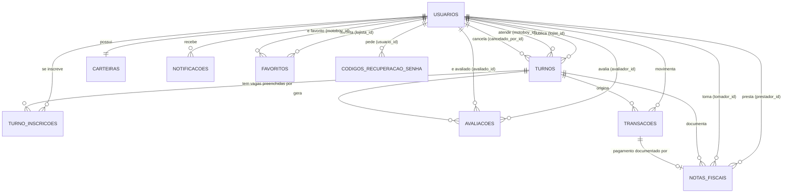

# DER — Diagrama Entidade-Relacionamento

Mapa das tabelas que compõem o banco de dados do **MotoShift**. O modelo reflete o schema real em produção (PostgreSQL no Railway), versionado por **Flyway** (migrações V1 a V24) e validado contra as entidades JPA do backend Spring Boot (`spring.jpa.hibernate.ddl-auto=validate`).

> **Escopo:** 9 tabelas — `usuarios`, `turnos`, `turno_inscricoes`, `avaliacoes`, `carteiras`, `transacoes`, `cobrancas`, `notificacoes`, `notas_fiscais`.
> Fonte da verdade: `backend/src/main/resources/db/migration` + `backend/src/main/java/com/motoshift/entity`.
> O diagrama em imagem (`der_motoshift.png`) é gerado a partir de `der_motoshift.mmd`; regenere-o quando o `.mmd` mudar.

## Diagrama

> Anexar aqui a imagem `der_motoshift.png`

Código-fonte do diagrama (Mermaid): `der_motoshift.mmd`, resumido abaixo.

```mermaid
erDiagram
    USUARIOS ||--o{ TURNOS : "publica (lojist_id)"
    USUARIOS ||--o{ TURNOS : "atende (motoboy_id)"
    USUARIOS ||--|| CARTEIRAS : "possui"
    USUARIOS ||--o{ TURNO_INSCRICOES : "se inscreve"
    USUARIOS ||--o{ AVALIACOES : "avalia (avaliador_id)"
    USUARIOS ||--o{ AVALIACOES : "e avaliado (avaliado_id)"
    USUARIOS ||--o{ TRANSACOES : "movimenta"
    USUARIOS ||--o{ NOTIFICACOES : "recebe"
    USUARIOS ||--o{ NOTAS_FISCAIS : "presta (prestador_id)"
    USUARIOS ||--o{ NOTAS_FISCAIS : "toma (tomador_id)"
    TURNOS   ||--o{ TURNO_INSCRICOES : "tem vagas preenchidas por"
    TURNOS   ||--o{ AVALIACOES : "gera"
    TURNOS   ||--o{ TRANSACOES : "origina"
    TURNOS   ||--o{ NOTAS_FISCAIS : "documenta"
    TRANSACOES ||--o| NOTAS_FISCAIS : "pagamento documentado por"
    USUARIOS ||--o{ FAVORITOS : "favorita (lojista_id)"
    USUARIOS ||--o{ TURNOS : "cancela (cancelado_por_id)"
    USUARIOS ||--o{ FAVORITOS : "e favorito (motoboy_id)"
    USUARIOS ||--o{ CODIGOS_RECUPERACAO_SENHA : "pede (usuario_id)"
```

## Visão geral das entidades

| Tabela | Representa | Chave primária | Restrições de unicidade |
|---|---|---|---|
| `usuarios` | Lojista ou motoboy — um único cadastro, diferenciado pelo campo `tipo` | `id` | `email` |
| `turnos` | Turno de entrega publicado pelo lojista (janela de horário, valor e local) | `id` | — |
| `turno_inscricoes` | Inscrição de um motoboy em um turno — permite turno com várias vagas | `id` | `uk_turno_motoboy (turno_id, motoboy_id)` |
| `avaliacoes` | Nota recíproca entre lojista e motoboy ao fim do turno | `id` | `uk_avaliacao (turno_id, avaliador_id, avaliado_id)` |
| `carteiras` | Saldo do usuário na plataforma: disponível + bloqueado | `id` | `usuario_id` |
| `transacoes` | Extrato — todo movimento de dinheiro gera um lançamento | `id` | `idempotency_key` |
| `cobrancas` | Recargas e saques no gateway — a fronteira com o dinheiro de fora | `id` | `idempotency_key` |
| `notificacoes` | Notificação in-app do usuário (SCRUM-20) | `id` | — |
| `notas_fiscais` | NFS-e do serviço prestado num turno — uma por par (turno, entregador) e uma por pagamento | `id` | `uk_nota_turno_prestador (turno_id, prestador_id)`, `uk_nota_transacao (transacao_id)` |
| `favoritos` | Entregador que a loja marcou com o coração (V18) | `(lojista_id, motoboy_id)` | a própria PK — um favorito por par |
| `codigos_recuperacao_senha` | Pedido de recuperação de senha: o hash do código de 6 dígitos, a validade e as tentativas gastas (V24) | `id` | — (vale o mais recente da conta) |

## Relacionamentos e cardinalidades

| Origem | Destino | Cardinalidade | Regra de negócio |
|---|---|---|---|
| `usuarios` | `turnos.lojist_id` | 1 : N | Um lojista publica vários turnos; todo turno tem exatamente um lojista |
| `usuarios` | `turnos.motoboy_id` | 0..1 : N | Aponta para o primeiro entregador inscrito; nulo enquanto o turno está aberto |
| `turnos` | `turno_inscricoes` | 1 : N | Uma inscrição por vaga preenchida, limitada pelo campo `vagas` |
| `usuarios` | `turno_inscricoes.motoboy_id` | 1 : N | Um motoboy se inscreve em vários turnos, mas só uma vez no mesmo turno |
| `turnos` | `avaliacoes` | 1 : N | Cada turno gera até 2 avaliações por par lojista/entregador |
| `usuarios` | `avaliacoes.avaliador_id / avaliado_id` | 1 : N (duplo) | Auto-relacionamento: o mesmo usuário avalia e é avaliado |
| `usuarios` | `carteiras` | 1 : 1 | Toda carteira tem um dono único — lojista ou entregador |
| `usuarios` | `transacoes.usuario_id` | 1 : N | Dono do lançamento; `contraparte_id` é o outro lado quando existe |
| `turnos` | `transacoes.turno_id` | 0..1 : N | Nulo em recarga e saque (operações de uma ponta só); a gorjeta (`bonus` / `bonus_enviado`, V17) aponta para o turno em que foi dada |
| `usuarios` | `notificacoes` | 1 : N | `referencia_tipo` + `referencia_id` fazem o deep link e a deduplicação |
| `turnos` | `notas_fiscais` | 1 : N | Uma nota por entregador do turno: três vagas, três notas |
| `usuarios` | `notas_fiscais.prestador_id / tomador_id` | 1 : N (duplo) | O entregador presta e o lojista toma; `emitida_por_id` registra quem clicou |
| `usuarios` | `turnos.cancelado_por_id` | 0..1 : N | Quem cancelou o turno (V19) — hoje, sempre o lojista dono |
| `usuarios` | `turno_inscricoes.cancelado_por_id` | 0..1 : N | Quem cancelou a inscrição (V22) — o próprio entregador (desistiu da vaga) ou o lojista (cancelou o turno) |
| `usuarios` | `favoritos.lojista_id / motoboy_id` | 1 : N (duplo) | A loja favorita vários entregadores e o entregador é favorito de várias lojas; o par é único. Quem é loja e quem é entregador é regra do `FavoritoService`; o banco só impede a conta de favoritar a si mesma |
| `usuarios` | `codigos_recuperacao_senha` | 1 : N | Os pedidos de recuperação de senha da conta (V24). Na prática 0 ou 1 linha: o backend apaga os anteriores ao gerar um código novo e ao concluir a troca. É a única FK `ON DELETE CASCADE` do schema |
| `transacoes` | `notas_fiscais.transacao_id` | 1 : 0..1 | A nota documenta o `pagamento_recebido` do extrato (V14). É o que impede nota e extrato de discordarem: o valor do serviço é o do lançamento |

## Dicionário de dados

### usuarios

| Coluna | Tipo | Nulo | Observação |
|---|---|---|---|
| `id` | BIGINT | não | PK, IDENTITY |
| `nome` | VARCHAR(255) | não | — |
| `email` | VARCHAR(255) | não | UNIQUE — usado como login. Sempre sem espaço nas pontas e em minúsculas (`Usuario.setEmail`); índice único `uk_usuario_email_lower` em `lower(email)` (V23), para a mesma caixa de correio em outra caixa não virar segunda conta |
| `senha` | VARCHAR(255) | não | Hash BCrypt — a V9 converteu as contas antigas que ainda estavam em texto puro |
| `telefone` | VARCHAR(255) | não | — |
| `tipo` | VARCHAR(255) | não | `lojista` \| `motoboy` |
| `documento_federal` | VARCHAR(255) | sim | CPF ou CNPJ |
| `data_nascimento`, `cidade`, `estado`, `foto_perfil` | DATE / VARCHAR | sim | Dados de perfil |
| `score` | FLOAT(53) | não | Default 5.0 |
| `media_avaliacao` | FLOAT(53) | sim | Calculada a partir de `avaliacoes` |
| `nome_fantasia`, `endereco_comercial` | VARCHAR(255) | sim | Preenchidos quando `tipo = lojista` |
| `meta_mensal` | NUMERIC(12,2) | sim | Meta de ganhos do mês do entregador (V19): pagamentos recebidos + gorjetas. CHECK `ck_usuario_meta_positiva`. Nula = sem meta (o painel convida a definir) |
| `latitude`, `longitude` | FLOAT(53) | sim | Ponto da loja no mapa (V15), marcado pelo lojista em "Dados pessoais". É de onde a publicação de turno parte — o pino do turno e o endereço comercial passam a ser o mesmo lugar. Nulos no entregador e em quem não marcou |
| `cnh_numero`, `cnh_categoria`, `cnh_validade` | VARCHAR / DATE | sim | Preenchidos quando `tipo = motoboy` (categoria A ou AB) |
| `veiculo_modelo`, `veiculo_placa`, `veiculo_ano`, `veiculo_cor` | VARCHAR / INTEGER | sim | Dados da moto do entregador |
| `tentativas_login` | INTEGER | não | Default 0 — bloqueio do RF01, no banco desde a V8 |
| `bloqueado_ate` | TIMESTAMP(6) | sim | Enquanto no futuro, o login responde 429 |
| `criado_em` | TIMESTAMP(6) | não | Imutável |

### turnos

| Coluna | Tipo | Nulo | Observação |
|---|---|---|---|
| `id` | BIGINT | não | PK |
| `lojist_id` | BIGINT | não | FK → `usuarios.id` (`fk_turno_lojista`, V11) |
| `motoboy_id` | BIGINT | sim | FK → `usuarios.id` (primeiro inscrito) |
| `titulo`, `descricao`, `regiao` | VARCHAR(255) | título obrigatório | Descrição do turno |
| `data_inicio`, `data_fim` | TIMESTAMP(6) | não | Janela do turno; base do job de expiração |
| `valor_estimado` | NUMERIC(12,2) | não | Migrado de FLOAT para NUMERIC na V3 |
| `raio_entrega_km` | FLOAT(53) | sim | Raio de atuação declarado pelo lojista |
| `latitude`, `longitude` | FLOAT(53) | sim | Ponto de partida — filtro por raio via Haversine (SCRUM-18) |
| `endereco` | VARCHAR(200) | sim | — |
| `vagas` | INTEGER | sim | Default 1 na aplicação |
| `status` | VARCHAR(255) | não | `aberto` \| `aceito` \| `em_andamento` \| `finalizado` \| `cancelado` \| `expirado` |
| `pagamento_status` | VARCHAR(255) | sim | `null` (não finalizado) \| `pendente` \| `pago` |
| `expirado_em` | TIMESTAMP(6) | sim | Preenchido quando o turno vai a `expirado`: pelo job de vencimento (ninguém aceitou até o início, SCRUM-19) ou pela finalização automática (terminou sem nenhum check-in, SCRUM-31) |
| `cancelado_por_id` | BIGINT | sim | FK `fk_turno_cancelado_por` → `usuarios.id` (V19): quem cancelou o TURNO. Só o lojista dono cancela o turno inteiro; em turno cancelado antes da V22 pode ser um entregador, da época em que os dois lados cancelavam. A saída de um entregador (desistência) não cancela o turno e mora em `turno_inscricoes`. Nulo no turno não cancelado e no cancelado antes da V19 |
| `cancelado_em` | TIMESTAMP(6) | sim | Quando foi cancelado (V19); índice `ix_turno_cancelado_por (cancelado_por_id, cancelado_em)` |
| `criado_em`, `atualizado_em` | TIMESTAMP(6) | criação obrigatória | Auditoria |

### turno_inscricoes

| Coluna | Tipo | Nulo | Observação |
|---|---|---|---|
| `id` | BIGINT | não | PK |
| `turno_id` | BIGINT | não | FK → `turnos.id` |
| `motoboy_id` | BIGINT | não | FK → `usuarios.id` |
| `status` | VARCHAR(255) | não | CHECK `ck_inscricao_status` (V21): `aceito` \| `finalizado` (fez check-in e foi pago) \| `faltou` (aceitou e não fez check-in — sem pagamento) \| `cancelado` |
| `pagamento_status` | VARCHAR(255) | sim | Pagamento por entregador. Na prática `pendente` é um instante: a finalização marca pendente, liquida e marca `pago` na mesma transação |
| `criado_em` | TIMESTAMP(6) | não | — |

| `checkin_em` | TIMESTAMP(6) | sim | Quando o entregador tocou "Cheguei" (V16). Nulo = não chegou, ou inscrição anterior à V16 |
| `checkin_latitude`, `checkin_longitude` | FLOAT(53) | sim | De onde fez o check-in — a distância até o ponto do turno é conferida na hora |
| `checkout_em` | TIMESTAMP(6) | sim | Quando tocou "Encerrar turno". CHECK `ck_inscricao_saida_apos_chegada`: só com check-in, e nunca antes dele |
| `cancelado_por_id` | BIGINT | sim | FK `fk_inscricao_cancelado_por` → `usuarios.id` (V22): quem cancelou esta inscrição. Igual a `motoboy_id` = o entregador **desistiu da vaga**; o id do lojista = a loja cancelou o turno. É daqui que o selo "30 dias sem cancelar" e a análise de score leem. Nulo na inscrição não cancelada |
| `cancelado_em` | TIMESTAMP(6) | sim | Quando foi cancelada (V22) — contra o início do turno, diz se a desistência foi em cima da hora. Índice `ix_inscricao_cancelado_por (cancelado_por_id, cancelado_em)` |

> `lojista_confirmou_em` e `motoboy_confirmou_em` **foram removidas pela V13**.
> Guardavam a dupla confirmação — cada parte declarando que o dinheiro tinha
> mudado de mãos fora do app —, que deixou de existir quando a liquidação passou
> a ser automática. A inscrição continua sendo a identidade de "esta pessoa
> neste turno": é por ela que a liquidação é chaveada
> (`liquidacao:inscricao:{id}:debito|credito`).

### avaliacoes

| Coluna | Tipo | Nulo | Observação |
|---|---|---|---|
| `id` | BIGINT | não | PK |
| `turno_id` | BIGINT | não | FK → `turnos.id` |
| `avaliador_id` | BIGINT | não | FK → `usuarios.id` |
| `avaliado_id` | BIGINT | não | FK → `usuarios.id` |
| `nota` | INTEGER | não | De 1 a 5 |
| `comentario` | VARCHAR(100) | sim | — |
| `criado_em` | TIMESTAMP(6) | não | — |

### carteiras

| Coluna | Tipo | Nulo | Observação |
|---|---|---|---|
| `id` | BIGINT | não | PK |
| `usuario_id` | BIGINT | não | UNIQUE, FK → `usuarios.id` |
| `saldo_atual` | NUMERIC(12,2) | não | Saldo disponível (nome de coluna mantido por compatibilidade) |
| `saldo_bloqueado` | NUMERIC(12,2) | não | Reservado para turnos publicados e ainda não liquidados |
| `versao` | BIGINT | sim | Trava otimista (`@Version`) contra escrita concorrente no saldo |
| `chave_pix` | VARCHAR(255) | sim | Destino do saque |
| `motoboy_id`, `ganhos_mensais` | BIGINT / NUMERIC | sim | Colunas legadas mantidas pela V4 — sem FK, ninguém mais as escreve |
| `atualizado_em` | TIMESTAMP(6) | sim | — |

### transacoes

| Coluna | Tipo | Nulo | Observação |
|---|---|---|---|
| `id` | BIGINT | não | PK |
| `usuario_id` | BIGINT | não | Dono do lançamento — FK → `usuarios.id` |
| `contraparte_id` | BIGINT | sim | O outro lado da operação — FK → `usuarios.id` |
| `turno_id` | BIGINT | sim | FK → `turnos.id` |
| `tipo` | VARCHAR(255) | não | CHECK `ck_transacao_tipo`: `recarga` \| `reserva` \| `liberacao_reserva` \| `pagamento_enviado` \| `pagamento_recebido` \| `saque` \| `bonus` (gorjeta recebida) \| `bonus_enviado` (gorjeta dada, V17) \| `estorno` \| `retencao_iss` \| `retencao_irrf` (V14) |
| `natureza` | VARCHAR(8) | não | CHECK `ck_transacao_natureza`: `credito` \| `debito`. O **sinal que a tela desenha** (V12) — não a aritmética do saldo: `reserva` é débito e não muda o patrimônio. Ver `docs/financeiro/FLUXO-FINANCEIRO.md` |
| `valor` | NUMERIC(12,2) | não | Migrado na V3 |
| `descricao` | VARCHAR(255) | sim | — |
| `status` | VARCHAR(255) | não | CHECK `ck_transacao_status`: `pendente` \| `concluido` \| `falhou` \| `estornado` |
| `operacao_id` | UUID | sim | Une os dois lados de uma transferência (V12). Sem FK: é agrupamento lógico, não referência a tabela |
| `saldo_disponivel_apos` | NUMERIC(12,2) | sim | Foto do saldo logo depois do lançamento (V12). `NULL` no histórico anterior — aquele saldo não é reconstruível |
| `saldo_bloqueado_apos` | NUMERIC(12,2) | sim | Idem, para o bloqueado |
| `idempotency_key` | VARCHAR(255) | não | UNIQUE, obrigatória desde a V10 e **determinística** desde a V12 — impede que a mesma operação mova dinheiro duas vezes |
| `motoboy_id` | BIGINT | sim | Coluna legada |
| `criado_em` | TIMESTAMP(6) | não | — |

### cobrancas

A fronteira com o dinheiro de fora. Tabela própria, e não mais um campo em
`transacoes`, porque os ciclos de vida são diferentes: o lançamento é um fato
consumado, a cobrança é um pedido em aberto que o gateway ainda vai responder.
Misturar faria o extrato ter linhas de intenção, e "saldo = soma do extrato"
deixaria de valer.

| Coluna | Tipo | Nulo | Observação |
|---|---|---|---|
| `id` | BIGINT | não | PK |
| `usuario_id` | BIGINT | não | FK → `usuarios.id` (`ON DELETE RESTRICT`) |
| `tipo` | VARCHAR(16) | não | CHECK `ck_cobranca_tipo`: `recarga` \| `saque` |
| `valor` | NUMERIC(12,2) | não | CHECK `ck_cobranca_valor`: sempre `> 0` — o sinal está no tipo, nunca no número |
| `status` | VARCHAR(16) | não | CHECK `ck_cobranca_status`: `pendente` \| `concluido` \| `falhou` |
| `codigo_pix` | VARCHAR(512) | sim | Copia-e-cola na recarga; chave de destino no saque |
| `criada_em` | TIMESTAMP(6) | não | — |
| `concluida_em` | TIMESTAMP(6) | sim | Quando o gateway respondeu. `NULL` enquanto aberta |
| `idempotency_key` | VARCHAR(255) | não | UNIQUE — idempotência do **pedido**, distinta da do lançamento que ele gera |

### notificacoes

| Coluna | Tipo | Nulo | Observação |
|---|---|---|---|
| `id` | BIGINT | não | PK |
| `usuario_id` | BIGINT | não | FK → `usuarios.id` |
| `tipo` | VARCHAR(40) | não | `turno_expirado`, `turno_vencendo`, `turno_aceito`, `pagamento_confirmado`, entre outros |
| `titulo` | VARCHAR(120) | não | — |
| `mensagem` | VARCHAR(255) | não | — |
| `referencia_tipo` | VARCHAR(20) | sim | Deep link: `turno` \| `avaliacao` \| `carteira` \| `nota_fiscal` |
| `referencia_id` | BIGINT | sim | Id do registro referenciado — polimórfico, por isso sem FK |
| `lida`, `lida_em` | BOOLEAN / TIMESTAMP | `lida` obrigatória | Default `false` |
| `criado_em` | TIMESTAMP(6) | não | — |

### favoritos

| Coluna | Tipo | Nulo | Observação |
|---|---|---|---|
| `lojista_id` | BIGINT | não | PK (com `motoboy_id`), FK `fk_favorito_lojista` → `usuarios.id` |
| `motoboy_id` | BIGINT | não | PK (com `lojista_id`), FK `fk_favorito_motoboy` → `usuarios.id`; índice `ix_favorito_motoboy` para o selo "Loja que já te chamou" |
| `criado_em` | TIMESTAMP(6) | não | Default `now()`. CHECK `ck_favorito_nao_a_si_mesmo` (`lojista_id <> motoboy_id`) |

### codigos_recuperacao_senha

| Coluna | Tipo | Nulo | Observação |
|---|---|---|---|
| `id` | BIGSERIAL | não | PK |
| `usuario_id` | BIGINT | não | FK `fk_codigo_recuperacao_usuario` → `usuarios.id`, **`ON DELETE CASCADE`**; índice `ix_codigo_recuperacao_usuario (usuario_id, id)` para "o código mais recente desta conta" |
| `codigo_hash` | VARCHAR(100) | não | BCrypt do código de 6 dígitos. O código em claro nunca é gravado: existe só no e-mail (simulado, no log do servidor) |
| `criado_em` | TIMESTAMP(6) | não | Quando foi pedido — é contra ele que se mede o intervalo de 1 minuto entre dois códigos da mesma conta |
| `expira_em` | TIMESTAMP(6) | não | `criado_em` + 15 minutos, gravado (e não calculado na leitura) para o prazo de um pedido não mudar com o código |
| `tentativas` | INTEGER | não | Default 0; CHECK `ck_codigo_recuperacao_tentativas` (`>= 0`). Sobe por `UPDATE ... WHERE tentativas < 5`: no quinto erro o código deixa de valer, mesmo com palpites simultâneos |

### notas_fiscais

| Coluna | Tipo | Nulo | Observação |
|---|---|---|---|
| `id` | BIGINT | não | PK |
| `turno_id` | BIGINT | não | FK → `turnos.id` |
| `transacao_id` | BIGINT | sim | FK → `transacoes.id` (V14) — o `pagamento_recebido` que a nota documenta. Único onde não é nulo: uma nota por pagamento |
| `operacao_id` | UUID | sim | A operação do ledger que gerou o pagamento (V14) — liga a nota às duas pernas e às retenções |
| `prestador_id` | BIGINT | não | FK → `usuarios.id` — o entregador |
| `tomador_id` | BIGINT | não | FK → `usuarios.id` — o lojista |
| `emitida_por_id` | BIGINT | não | FK → `usuarios.id` — quem disparou a emissão: o lojista (tomador), que é quem emite. Notas antigas podem ter o entregador |
| `numero` | INTEGER | não | Sequencial por prestador |
| `serie` | VARCHAR(8) | não | Série única (`A1`) neste MVP |
| `codigo_verificacao` | VARCHAR(16) | não | Derivado dos dados da própria nota (SHA-256) |
| `chave_acesso` | VARCHAR(50) | sim | Chave de acesso de 50 dígitos no formato da NFS-e nacional (V20) — município IBGE, ambiente gerador, inscrição do emitente, número, AAMM, código numérico e DV módulo 11. Gravada na emissão; nula nas notas anteriores à V20, que a recebem derivada na leitura. Índice único parcial `uk_nota_chave_acesso` |
| `descricao_servico` | VARCHAR(300) | não | — |
| `valor_servico` | NUMERIC(12,2) | não | Base de cálculo |
| `iss_aliquota`, `iss_valor` | NUMERIC(6,4) / NUMERIC(12,2) | não | ISS municipal |
| `irrf_aliquota`, `irrf_valor` | NUMERIC(6,4) / NUMERIC(12,2) | não | IRRF |
| `tributos_retidos` | BOOLEAN | não | `true` quando ISS e IRRF saíram do pagamento (há lançamentos `retencao_*` no extrato); `false` quando são informativos, pela Lei 12.741/2012 (V14) |
| `valor_liquido` | NUMERIC(12,2) | não | Com retenção, serviço menos os tributos; sem ela, o próprio valor do serviço — que é o que o extrato creditou |
| `competencia` | TIMESTAMP(6) | não | Data do serviço, isto é, o início do turno (V14). É por ela que se filtra a nota, não pela emissão |
| `emitida_em` | TIMESTAMP(6) | não | — |
| `cancelada_em`, `motivo_cancelamento` | TIMESTAMP / VARCHAR(255) | sim | Só o lojista (tomador) cancela — o mesmo lado que emite |

## Notas de modelagem

- **Integridade referencial no banco, ids nas entidades.** Desde a V11 as 16 referências entre tabelas são `FOREIGN KEY` de verdade, com `ON DELETE RESTRICT` — o banco recusa turno de lojista inexistente ou avaliação órfã, venha o INSERT do app, de um script ou de um console. As entidades JPA continuam referenciando por `Long` (ex.: `lojistId`), sem `@ManyToOne`: são duas decisões separadas, e a navegação por objeto não tem uso no app (traria carga preguiçosa, N+1 em getter e serialização recursiva no JSON). Ficam de fora as colunas legadas (`carteiras.motoboy_id`, `transacoes.motoboy_id`) e `notificacoes.referencia_id`, que é polimórfica.
- **FK adicionada como `NOT VALID` e validada em seguida.** Uma linha órfã antiga não derruba o deploy: a restrição passa a valer para linhas novas e fica registrada como não validada até a limpeza (`SELECT conname FROM pg_constraint WHERE contype = 'f' AND NOT convalidated`).
- **Dinheiro em NUMERIC(12,2).** A migração V3 converteu `valor_estimado`, `valor`, `saldo_atual` e `ganhos_mensais` de `FLOAT` para `NUMERIC`: ponto flutuante binário não representa decimais exatos e o erro acumula a cada soma de saldo.
- **Enums persistidos em minúsculo.** `StatusTurno`, `StatusInscricao`, `StatusPagamento`, `TipoTransacao` e `StatusTransacao` usam converters próprios — o valor no banco e no JSON é sempre minúsculo, nunca o `name()` do enum. Em `transacoes`, o domínio também está no banco, como CHECK.
- **`pagamento_status` nulo tem significado.** Nulo = turno ainda não finalizado; `pendente` = finalizado e devendo; `pago` = ambas as partes confirmaram.
- **Idempotência obrigatória no extrato.** Todo lançamento tem chave: `pagamento_turno:{turno}:{motoboy}` para pagamento de turno, `saque:{usuario}:{chave do cliente}` quando o cliente manda `Idempotency-Key`, `legado:{id}` para as linhas anteriores à V10.
- **Colunas legadas preservadas.** `carteiras.motoboy_id`, `carteiras.ganhos_mensais` e `transacoes.motoboy_id` permanecem no banco com o histórico intacto, apenas sem `NOT NULL`.
- **FKs das V18 e V19, com a mesma regra.** `favoritos.lojista_id`, `favoritos.motoboy_id` e `turnos.cancelado_por_id` são `ON DELETE RESTRICT` como as da V11. O reset "só da massa" apaga os favoritos que tocam uma conta da massa e esvazia `cancelado_por_id` de turno real cancelado por ela — sem isso, a FK travaria o reset (`ResetDaMassaPostgresTest`).
- **A única FK em cascata (V24).** `codigos_recuperacao_senha.usuario_id` é `ON DELETE CASCADE`, ao contrário de todas as outras: o código não é histórico de ninguém — é uma credencial de 15 minutos que não significa nada sem a conta, e não deve impedir apagá-la. O reset da massa apaga os códigos explicitamente mesmo assim, porque no H2 do dev (criado pelo Hibernate) essa FK não existe.
- **O que não virou tabela.** Pontualidade (V16) e selos de reputação (Fase 7) são calculados na hora a partir de `turno_inscricoes`, `avaliacoes`, `transacoes` e `turnos`: um valor guardado envelheceria. O lembrete de 1 hora também não tem coluna de controle — a notificação que já existe (`ix_notificacao_dedup`) é o controle.
- **Índices de desempenho.** `ix_turno_status_inicio`, `ix_turno_status_fim` e `ix_turno_geo` sustentam a listagem de turnos disponíveis, o job de expiração e o pré-filtro por bounding box do filtro de raio; `ix_notificacao_dedup` evita notificação repetida a cada execução do job; `ix_inscricao_motoboy` e `ix_avaliacao_avaliador` (V11) cobrem as consultas por pessoa e a verificação das FKs.

## Rastreabilidade

| Migração | O que mudou no modelo |
|---|---|
| `V1__baseline` | Schema inicial: `usuarios`, `turnos`, `turno_inscricoes`, `carteiras`, `transacoes`, `avaliacoes` |
| `V2__p0_scrum_17_20` | Geolocalização e `expirado_em` em `turnos`; tabela `notificacoes`; unicidade do trio em `avaliacoes`; índices |
| `V3__dinheiro_para_numeric` | Colunas monetárias de `FLOAT` para `NUMERIC(12,2)` |
| `V4__carteira_usuario` | Carteira de qualquer usuário, `saldo_bloqueado`, `versao`, extrato com dois lados e chave de idempotência |
| `V5__backfill_inscricoes_legado` | Backfill de `turno_inscricoes` a partir dos turnos antigos |
| `V6__remove_confirmacao_do_turno` | Confirmação de pagamento passa a viver só na inscrição |
| `V7__notas_fiscais` | Tabela `notas_fiscais` — NFS-e por par (turno, prestador) |
| `V8__bloqueio_de_login` | `tentativas_login` e `bloqueado_ate` em `usuarios`: o bloqueio do RF01 sai da memória |
| `V9__Senhas_legadas_para_bcrypt` | Migração Java: converte para BCrypt as senhas ainda em texto puro |
| `V10__transacao_tipo_status_e_idempotencia` | Unifica as palavras legadas (`turno`→`pagamento_recebido`, `processado`→`concluido`), preenche `idempotency_key` em toda linha (que vira `NOT NULL`) e fecha o domínio com CHECK |
| `V11__chaves_estrangeiras` | 16 FKs com `ON DELETE RESTRICT`, mais os índices que elas exigem |
| `V12__ledger_financeiro` | `natureza`, `operacao_id` e os dois snapshots de saldo em `transacoes`; tabela `cobrancas` com FK real. É a migração que dá ao dinheiro origem e destino — antes a liquidação creditava sem debitar ninguém |
| `V13__remove_dupla_confirmacao` | CONTRACT: derruba `lojista_confirmou_em` e `motoboy_confirmou_em` de `turno_inscricoes`. Com a liquidação automática não há o que confirmar |
| `V14__fiscal_por_lancamento` | Aditiva: `transacao_id`, `operacao_id`, `competencia` e `tributos_retidos` em `notas_fiscais`, com backfill ligando cada nota ao `pagamento_recebido` do turno; `uk_nota_transacao` e `ix_nota_competencia`; o CHECK de `transacoes.tipo` ganha `retencao_iss` e `retencao_irrf`. A nota passa a documentar o lançamento do extrato, não só o turno — ver [`docs/financeiro/FISCAL.md`](../financeiro/FISCAL.md) |
| `V15__coordenada_da_loja` | Aditiva: `latitude` e `longitude` em `usuarios` — o ponto da loja. A publicação parte dele (depois do GPS e da cidade), em vez do GPS de onde o lojista estiver publicando |
| `V16__checkin_do_entregador` | Aditiva: `checkin_em`, `checkin_latitude`, `checkin_longitude` e `checkout_em` em `turno_inscricoes` — a hora real de cada entregador, na inscrição porque num turno multi-vaga cada um chega na sua hora; CHECK de saída depois da chegada; índice `ix_inscricao_checkin` para a pontualidade |
| `V17__gorjeta` | O CHECK de `transacoes.tipo` ganha `bonus_enviado`, o lado de quem dá a gorjeta; o `bonus`, que estava no domínio desde a V10 sem fluxo, vira o lado de quem recebe. Sem coluna nova: a gorjeta é o par de lançamentos, e "uma por entregador por turno" é a chave de idempotência |
| `V18__favoritos` | Tabela nova `favoritos (lojista_id, motoboy_id, criado_em)`, o par como chave primária, FKs para `usuarios` e índice por entregador. Aditiva: nada existente muda |
| `V19__meta_do_mes_e_quem_cancelou` | Aditiva: `meta_mensal` em `usuarios` (CHECK positiva) e `cancelado_por_id` (FK) e `cancelado_em` em `turnos`, com índice. Os selos de reputação não têm tabela: são calculados do histórico |
| `V20__chave_de_acesso_da_nfse` | Aditiva: `chave_acesso` em `notas_fiscais`, com índice único parcial `uk_nota_chave_acesso`. É a chave que o DANFSe (leiaute da NT SE/CGNFS-e nº 008/2026) mostra no topo; sem backfill — ver [`docs/financeiro/FISCAL.md`](../financeiro/FISCAL.md) |
| `V21__inscricao_faltou` | O status da inscrição ganha `faltou` e o domínio vai para o banco (CHECK `ck_inscricao_status`, NOT VALID + VALIDATE como na V10). Finalizar passou a pagar só quem fez check-in; a inscrição aceita sem check-in vira `faltou` e a parte dela volta ao lojista como sobra |
| `V22__desistencia_na_inscricao` | Aditiva: `cancelado_por_id` (FK) e `cancelado_em` em `turno_inscricoes`, com índice. "Cancelar" virou duas ações — a loja cancela o turno, o entregador desiste da vaga dele —, e a desistência não cancela o turno, então precisa de lugar próprio. Backfill: os turnos cancelados antes levam autor e data para as inscrições canceladas deles |
| `V23__email_sem_maiusculas` | O e-mail deixa de diferenciar maiúsculas: confere antes se há contas que só diferem pela caixa ou por espaços (se houver, **falha** dizendo quais, em vez de escolher uma), normaliza as linhas (`lower(trim(email))`) e cria o índice único `uk_usuario_email_lower` em `lower(email)` |
| `V24__codigos_de_recuperacao_de_senha` | Tabela nova `codigos_recuperacao_senha (id, usuario_id, codigo_hash, criado_em, expira_em, tentativas)`, com FK em cascata para `usuarios`, CHECK no contador e índice por conta. Aditiva: nada existente muda. Guarda o hash BCrypt do código, nunca o código (SCRUM-32) |
