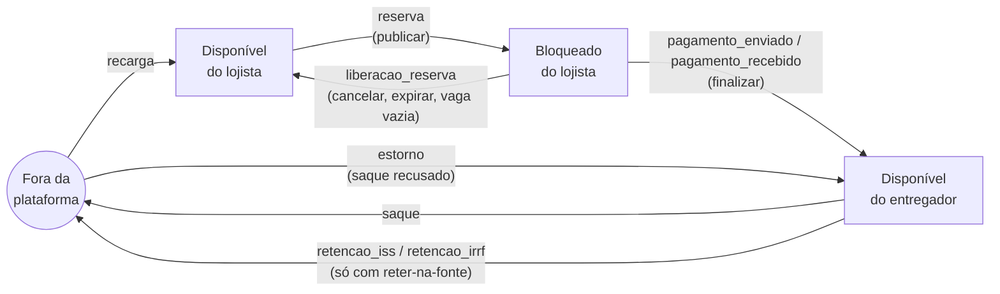
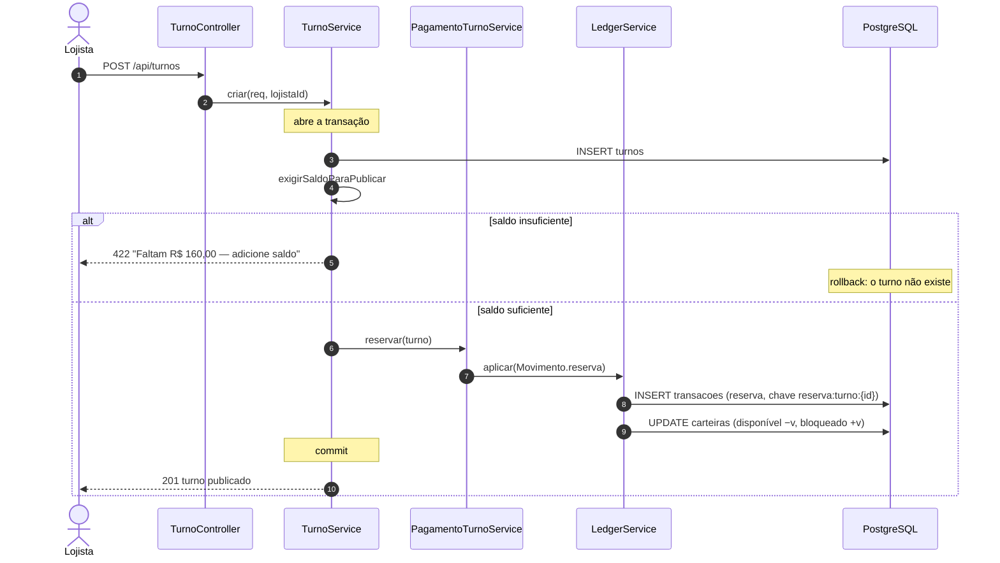
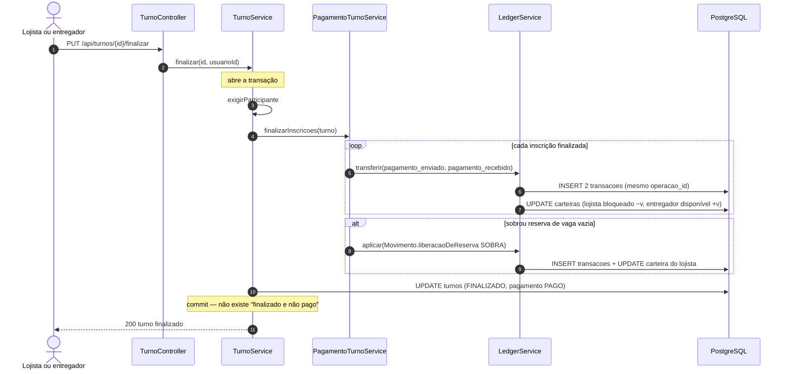
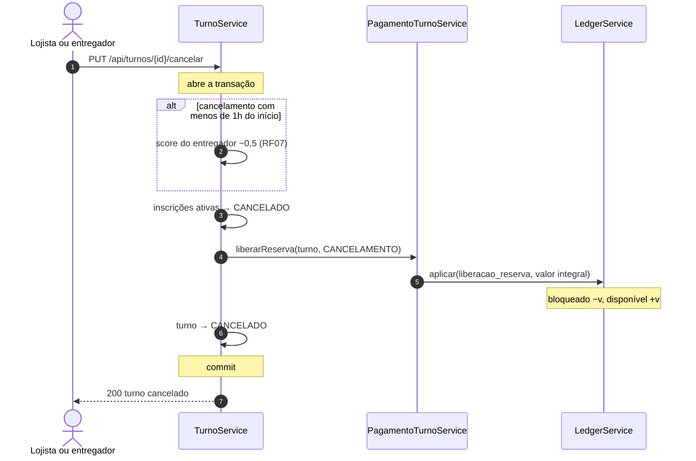
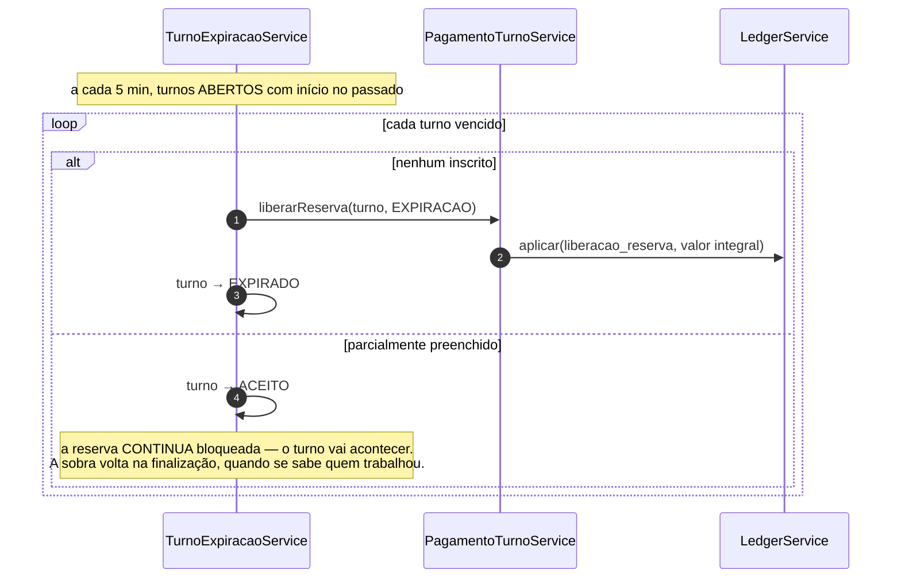
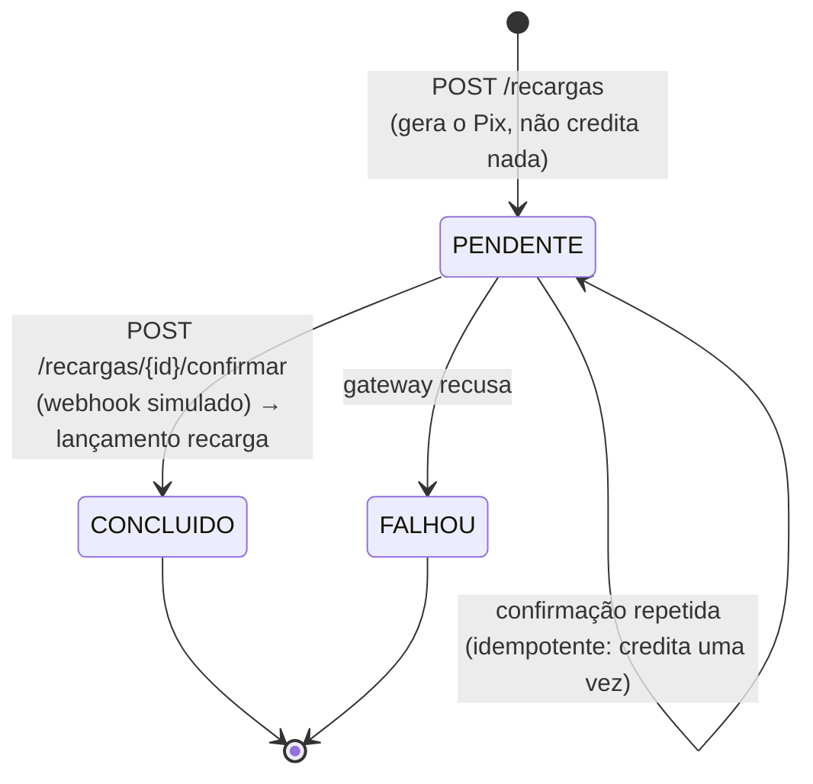
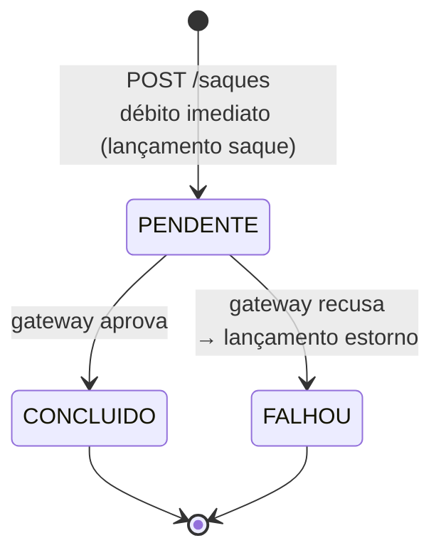

# Fluxo financeiro do MotoShift

> **O que este documento responde:** de onde vem o dinheiro que aparece na
> carteira de um entregador, para onde ele vai, e por que não é possível criá-lo
> sem tirá-lo de outro lugar.

---

## 1. O problema que isto resolve

Até a V11, a liquidação de um turno **creditava o entregador sem debitar
ninguém**. O código era literalmente este:

```java
// PagamentoTurnoService, antes da V12
carteira.setSaldoDisponivel(carteira.getSaldoDisponivel().add(valor));
carteiraRepo.save(carteira);
```

Não havia contrapartida. O saldo do lojista não era consultado ao publicar um
turno, `saldoBloqueado` existia na tabela desde a V4 e nunca era movimentado, e
o pagamento só acontecia se as duas partes apertassem um botão declarando que o
dinheiro tinha mudado de mãos **fora do app**.

Três defeitos, e nenhum deles era de implementação:

1. **O crédito não tinha origem.** Somando todas as carteiras, o total crescia
   sozinho — a plataforma fabricava dinheiro a cada turno finalizado.
2. **Turno publicado não tinha lastro.** Nada garantia que o lojista tivesse o
   valor; a conta só chegava no fim, quando o trabalho já tinha sido feito.
3. **Quem trabalhou dependia de um clique alheio.** Se o lojista não
   confirmasse, o entregador não recebia, e o app não tinha o que fazer.

O ciclo abaixo existe para que nenhum dos três volte a ser possível.

---

## 2. O ciclo do dinheiro



**Poucas setas atravessam a fronteira da plataforma:** `recarga` e `saque` (e o
`estorno`, que desfaz um saque recusado), mais as retenções na fonte, que só
existem quando `motoshift.fiscal.reter-na-fonte` está ligado — ver
[`FISCAL.md`](FISCAL.md). Tudo o mais é transferência interna. É disso que sai a
terceira invariante, na seção 6.

### As quatro etapas

| Etapa | O que acontece | Quem dispara |
|---|---|---|
| **Recarga** | O lojista abre uma cobrança Pix e a paga. O valor entra no disponível. | `POST /api/carteira/recargas` + `/confirmar` |
| **Reserva** | Publicar um turno move `valorEstimado × vagas` do disponível para o bloqueado. | `POST /api/turnos` |
| **Liquidação** | Finalizar transfere, por entregador, do bloqueado do lojista para o disponível do entregador. A sobra das vagas vazias volta. | `PUT /api/turnos/{id}/finalizar` |
| **Saque** | O entregador (ou o lojista) envia o disponível para a chave Pix. | `POST /api/carteira/saques` |

---

## 3. Diagramas de sequência

### 3.1 Publicar um turno

A reserva acontece na **mesma transação** que grava o turno: ou ele nasce com
lastro, ou não nasce.



### 3.2 Finalizar um turno



> **Por que os dois participantes podem finalizar.** Antes, quem finalizava
> disparava uma cobrança contra o outro. Hoje finalizar **não cria compromisso
> nenhum**: só move o dinheiro que o lojista já separou ao publicar, e nem o
> valor nem o destinatário dependem de quem clicou.

### 3.3 Cancelar



**Sem multa financeira.** A penalidade do cancelamento tardio é de score, e
continua sendo a única — inventar uma multa seria criar regra de negócio no meio
de uma refatoração.

### 3.4 Expirar (job)



---

## 4. Diagramas de estado

### 4.1 Cobrança de recarga



### 4.2 Cobrança de saque



> **Por que o débito vem antes de pedir ao gateway.** Se viesse depois da
> resposta, entre uma coisa e outra o mesmo saldo poderia ser sacado de novo ou
> gasto num turno. Debitar primeiro fecha essa janela.
>
> **Por que o débito recusado continua no extrato.** Ele aconteceu. O estorno é
> um segundo lançamento que traz o valor de volta; as duas linhas somam zero, que
> é exatamente a verdade. Apagar o débito seria reescrever o passado — e abriria
> uma exceção nas invariantes para "saque que não valeu".

---

## 5. Tipos de lançamento

Cada linha da tabela `transacoes` é um movimento que aconteceu. A tabela abaixo é
a mesma que está codificada em `service/ledger/Movimento.java`, em um lugar só.

| Tipo | Natureza | Δ disponível | Δ bloqueado | Δ total | Contraparte | Chave de idempotência |
|---|---|---|---|---|---|---|
| `recarga` | crédito | +v | 0 | **+v** | — | `recarga:{cobrancaId}` |
| `reserva` | débito | −v | +v | 0 | — | `reserva:turno:{turnoId}` |
| `liberacao_reserva` | crédito | +v | −v | 0 | — | `liberacao:turno:{id}:{motivo}` |
| `pagamento_enviado` | débito | 0 | −v | **−v** | entregador | `liquidacao:inscricao:{id}:debito` |
| `pagamento_recebido` | crédito | +v | 0 | **+v** | lojista | `liquidacao:inscricao:{id}:credito` |
| `saque` | débito | −v | 0 | **−v** | — | `saque:{cobrancaId}` |
| `estorno` | crédito | +v | 0 | **+v** | — | `estorno:saque:{cobrancaId}` |
| `bonus` | crédito | +v | 0 | **+v** | — | (não emitido hoje) |
| `retencao_iss` | débito | −v | 0 | **−v** | — | `liquidacao:inscricao:{id}:retencao-iss` |
| `retencao_irrf` | débito | −v | 0 | **−v** | — | `liquidacao:inscricao:{id}:retencao-irrf` |

`{motivo}` ∈ `cancelamento` | `expiracao` | `sobra`.

### Natureza não é a aritmética do saldo

`natureza` é **o sinal que a tela desenha**, e só isso. Repare que a coluna "Δ
total" discorda dela em três linhas: `reserva` é débito mas não muda o
patrimônio do lojista (o dinheiro foi de um bolso para o outro), e o mesmo vale
para `liberacao_reserva`.

A coluna existe porque o app decidia o sinal por uma lista de tipos conhecidos —
e um tipo que a versão instalada não conhecesse virava crédito por omissão. Uma
reserva de R$ 360 aparecia no extrato **com sinal de mais**. Gravar a direção
junto com o lançamento resolve isso para qualquer versão do cliente.

Somar `valor` com o sinal de `natureza` **não** devolve o saldo. Quem sabe qual
bolso se move é o `Movimento`, e é dele que as invariantes partem.

### Por que a coluna "Δ total" fecha

Somando a coluna sobre **todas as carteiras**:

- `reserva` e `liberacao_reserva` valem 0 — são internas à mesma carteira;
- `pagamento_enviado` (−v no lojista) e `pagamento_recebido` (+v no entregador)
  se anulam, porque são as duas pernas do mesmo evento e têm o mesmo `valor`;
- sobram `recarga` (+), `saque` (−), `estorno` (+) e as retenções (−).

As retenções só existem com `motoshift.fiscal.reter-na-fonte` ligado, e são
dinheiro saindo da plataforma como o saque: o destino é o fisco, que aqui é
simulado e não tem carteira. Ver [`FISCAL.md`](FISCAL.md).

Daí a invariante (c).

---

## 6. As três invariantes

Conferidas por `ConsistenciaService.verificarConsistencia()` e por
`GET /api/dev/ledger/consistencia` (apenas no perfil `dev` — é trabalho
O(banco inteiro), não rota de produção).

### (a) Nenhum saldo negativo

Em **nenhum dos dois bolsos**. Bloqueado negativo seria liberar uma reserva que
não existe — dinheiro saindo pela porta dos fundos.

> **Como é garantida:** `LedgerService.exigirNaoNegativo` roda em toda mutação,
> antes de gravar. Disponível negativo vira 422 para o usuário; bloqueado
> negativo vira `IllegalStateException` com a chave no log, porque não é erro de
> quem chamou — é defeito do backend.

### (b) Carteira = extrato

Para cada usuário, `saldoDisponivel` e `saldoBloqueado` são exatamente a soma
dos deltas dos lançamentos **concluídos** dele.

> **Como é garantida:** o saldo nunca é escrito fora do `LedgerService`, e lá ele
> só muda junto com o lançamento correspondente, na mesma transação. Nenhum
> outro ponto do backend chama `setSaldoDisponivel`.
>
> Lançamentos `pendente` ficam de fora da soma: sobraram no banco do fluxo
> antigo — dívida reconhecida que a dupla confirmação nunca quitou — e não
> mexeram em saldo nenhum.

### (c) A plataforma não cria nem destrói dinheiro

```
Σ (disponível + bloqueado) de todas as carteiras
    = Σ recargas concluídas − Σ saques concluídos + Σ estornos
      + Σ bônus − Σ retenções na fonte
```

> **Como é garantida:** pela tabela da seção 5. Só `recarga`, `saque`,
> `estorno`, `bonus` e as duas retenções têm Δ total diferente de zero. Os três
> primeiros nascem em um arquivo só — `CobrancaService`, a única porta para
> fora —, e as retenções em outro, `PagamentoTurnoService`, na mesma transação
> do pagamento que as originou.

---

## 7. Como a corretude é sustentada

### Transação

`LedgerService` é `@Transactional(propagation = MANDATORY)`: ele **nunca abre**
transação, exige estar dentro de uma. Duas consequências queridas:

- mexer em dinheiro fora de transação falha alto, em vez de commitar sozinho;
- a liquidação de um turno acontece na mesma transação que muda o status dele,
  então o estado "turno finalizado mas não pago" não é alcançável.

### `@Version` + retry

`Carteira` tem `@Version`. Duas operações simultâneas na mesma carteira — o turno
de um lojista liquidando enquanto ele publica outro — leem o mesmo saldo, e sem a
trava uma sobrescreveria a outra: o segundo pagamento sairia de graça.

O retry vive em `RetentativaOtimista`, aplicado por **quem abre a transação** (o
controller, o job), e não dentro do ledger. O motivo é que, quando a exceção
aparece, a transação inteira já está condenada ao rollback — repetir só o trecho
do ledger tentaria gravar dentro de uma transação morta.

São três tentativas, com recuo e **jitter** entre elas. O recuo não é
preciosismo: o teste de concorrência mostrou que, repetindo na hora, as operações
falhavam juntas e tentavam de novo juntas, esgotando as três tentativas em ~70 ms
sem que nenhuma passasse. O componente aleatório é o que de fato desempata.

Três tentativas cobrem **colisão pontual**. Uma carteira sob dezenas de escritas
simultâneas é outro problema — pressão sustentada — e ali insistir só empurra a
fila; quem chamou recebe a exceção e o usuário, um 409.

### Idempotência

Toda gravação do ledger tem chave determinística (seção 5) com índice único no
banco. O fluxo é: procurar a chave → se existe, devolver o lançamento anterior
sem tocar em saldo; se não, gravar com `flush` **antes** de salvar a carteira.

A checagem é o caminho rápido; **a garantia é o índice**. Se duas execuções com a
mesma chave passarem juntas pela checagem, o índice barra a segunda e a transação
inteira volta — saldo incluso.

É isso que faz:

- confirmar a mesma recarga duas vezes creditar uma vez;
- finalizar o mesmo turno duas vezes transferir uma vez;
- o retry acima ser seguro: na segunda tentativa, o que já commitou é
  reencontrado pela chave em vez de lançado de novo.

### Snapshot de saldo

Cada lançamento guarda `saldo_disponivel_apos` e `saldo_bloqueado_apos`. Serve ao
extrato (mostrar o saldo linha a linha sem refazer a soma) e à conferência: uma
divergência entre carteira e extrato pode ser localizada no lançamento exato em
que começou.

Nas linhas anteriores à V12 as colunas são `NULL`, de propósito — o saldo daquele
instante não é reconstruível, e uma coluna nula diz "não sei" enquanto um número
aproximado diria uma mentira conferível.

---

## 8. O gateway

`GatewayPagamento` é uma interface de dois métodos, com uma implementação:
`GatewayPagamentoSimulado`.

Não é preparação especulativa para um provedor futuro — é onde a **fronteira do
sistema** fica visível. Tudo abaixo dessa linha é irreversível e não acontece no
nosso banco: um Pix que cai na conta de alguém não volta com um `ROLLBACK`.

O simulado gera um código no formato BR Code (EMV) com conteúdo inventado — o CRC
é fixo, e é o primeiro campo que um app de banco recusaria. Uma chave Pix que
contenha `recusar` é sempre rejeitada: determinístico de propósito, para o teste
de estorno não ficar intermitente e para a recusa poder ser demonstrada ao vivo.

**O gateway nunca mexe em saldo.** Ele responde "entrou" ou "saiu"; quem credita e
debita é o ledger.

---

## 9. Onde olhar no código

| Pergunta | Arquivo |
|---|---|
| Qual bolso cada tipo move? | `service/ledger/Movimento.java` |
| Quem pode alterar saldo? | `service/ledger/LedgerService.java` |
| Como a concorrência é tratada? | `service/ledger/RetentativaOtimista.java` |
| As invariantes fecham? | `service/ledger/ConsistenciaService.java` |
| Reserva, liquidação, liberação | `service/PagamentoTurnoService.java` |
| Recarga e saque | `service/CobrancaService.java` |
| Fronteira com o mundo de fora | `service/gateway/GatewayPagamento.java` |
| Extrato, resumo, fluxo, CSV | `service/ExtratoService.java` |
| Que documento cada lançamento gera | `service/fiscal/TipoDocumento.java` — ver [`FISCAL.md`](FISCAL.md) |
| Retenção na fonte e alíquotas | `service/fiscal/CalculoTributario.java` |
| Schema | `db/migration/V12__ledger_financeiro.sql`, `V13__remove_dupla_confirmacao.sql`, `V14__fiscal_por_lancamento.sql` |

### Testes que sustentam este documento

| Afirmação | Teste |
|---|---|
| Idempotência, chão em zero, snapshot | `LedgerServiceTest` |
| Publicar sem saldo → 422; 3 vagas/2 inscritos; cancelar; expirar | `ReservaELiquidacaoTest` |
| Recarga em dois tempos; saque recusado estorna | `CobrancaServiceTest` |
| Liquidações simultâneas na mesma carteira | `ConcorrenciaDoLedgerTest` |
| 120 operações sorteadas mantêm (a), (b) e (c) | `InvarianteTest` |
| Cada filtro do extrato, isolado e combinado | `ExtratoServiceTest` |
| Retenção: bruto no extrato, líquido na nota | `service/fiscal/RetencaoNaFonteTest` |
| A massa de demonstração fecha nas invariantes | `MassaDemonstracaoTest` |
