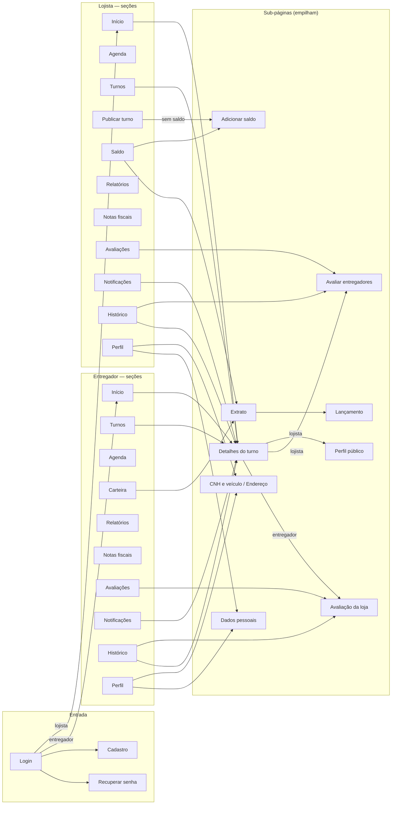

# Navegação do MotoShift

> **O que este documento responde:** por onde se anda no app, o que acontece
> com o botão voltar em cada lugar, que nome cada coisa tem, e o que a pessoa
> pode fazer com um turno depois que ele acaba.

A fonte de verdade de tudo que está aqui é código, não este texto:
[`lib/routes/nav_config.dart`](../../Motoshift/lib/routes/nav_config.dart)
para o menu e a regra de navegação, e
[`lib/app.dart`](../../Motoshift/lib/app.dart) (`rotasDoApp()`) para a tabela
de rotas. Os testes da seção 8 falham quando o código e este documento deixam
de concordar.

---

## 1. O problema que isto resolve

A navegação estava escrita em quatro lugares que precisavam concordar e não
concordavam: a barra lateral do desktop tinha a lista completa, a gaveta do
celular a reaproveitava, e **sete telas** carregavam um `switch (i)` copiado à
mão para a barra inferior. Os sintomas:

- a Agenda montava a barra do **lojista** para os dois papéis — o entregador
  tocava em "Início" e caía num dashboard que o `AuthGuard` recusava;
- itens de menu **empilhavam** telas: Turnos → Carteira → Perfil deixava três
  telas atrás, e o voltar contava uma história que a pessoa não viveu;
- telas abertas pelo menu tinham uma seta que dava `pop()` na última rota e
  deixava a tela **preta**;
- botões e telas que não levavam a lugar nenhum (seção 7).

---

## 2. A regra

Duas categorias de destino, e só duas.

| Categoria | Exemplos | Como navega | Voltar |
|---|---|---|---|
| **Seção** — item do menu ou da barra inferior | Início, Turnos, Carteira, Avaliações, Perfil | `NavConfig.irParaSecao` → `pushNamedAndRemoveUntil(rota, (_) => false)` | Não há pilha. O canto esquerdo mostra o **menu** |
| **Sub-página** — detalhe, formulário, tela de apoio | Detalhe do turno, Extrato, Adicionar saldo, Avaliação | `Navigator.pushNamed` | Seta, `pop`, volta para onde veio |

Por que a seção substitui a pilha: seções são irmãs, não uma dentro da outra.
Ir de Turnos para Carteira não é "entrar" na Carteira a partir de Turnos.

**Toda tela tem saída.** O `AppHeader` decide o canto esquerdo nesta ordem:

1. há para onde voltar → **seta** (`pop`);
2. não há, mas a tela é seção → **menu** (gaveta no celular; no desktop a
   barra lateral está sempre visível);
3. nem uma coisa nem outra → **ícone de início**, que leva à raiz do papel
   (`NavConfig.voltarParaRaiz`).

A tela não escolhe nada disso. Ela informa só `rotaDaSecao:` ao
`AdaptiveScaffold`, e a barra inferior, a gaveta e o destaque do menu vêm do
`NavConfig`. Sub-página não informa nada; o desktop descobre a seção pelo nome
da rota (`NavConfig.secaoDe`) — quem está no Extrato vê "Carteira" destacada.

---

## 3. O mapa

### Menu por papel

| Seção | Entregador | Lojista |
|---|---|---|
| **OPERAÇÃO** | Início · Turnos · Agenda | Início · Agenda · Turnos · Publicar turno |
| **FINANCEIRO** | Carteira · Relatórios · Notas fiscais | Saldo · Relatórios · Notas fiscais |
| **AVALIAÇÕES** | Avaliações (selo com as pendentes) | Avaliações (selo com as pendentes) |
| **CONTA** | Notificações · Histórico · Perfil | Notificações · Histórico · Perfil |
| Barra inferior (celular) | Início · Turnos · Carteira · Perfil | Início · Agenda · Turnos · Perfil |

A barra inferior tem quatro itens porque é o que cabe em 390 px com rótulo
legível. O menu é completo; a barra é o atalho do dia a dia.

### Celular × desktop

| | Celular (< 1024 px) | Desktop (≥ 1024 px) |
|---|---|---|
| Menu | Gaveta, aberta pelo header | Barra lateral fixa |
| Lista de turnos | Tocar empilha o detalhe | Master-detail: tocar troca o painel da direita |
| `/detalhe-turno`, `/turno-lojista` | Página | Redirecionam para a lista com o turno selecionado — e a aba muda para uma que o contenha |
| Avaliação da loja | Página | Modal de 480 px sobre a tela de origem (rota `opaque: false`) |

---

## 4. Um conceito, um nome

O item de menu, o título da tela e o botão que leva até ela dizem a mesma
coisa. Quando dois nomes conviviam, o que ficou está na coluna da esquerda.

| Nome | Não usar mais | Onde aparecia o outro nome |
|---|---|---|
| Turnos (entregador) | Turnos disponíveis | Título do desktop |
| Relatórios | Relatórios financeiros | Título do desktop |
| Histórico | Histórico de turnos | Título das duas larguras |
| Publicar turno | Publicar novo turno · Publicar Turno | Rodapé da lista, card do início, header |
| Detalhes do turno | Detalhes do Turno · Turno | Header do entregador · header do lojista |
| Turnos aceitos | Próximos turnos · Meus turnos | Lista do celular · lista do desktop |
| Avaliações | Minhas avaliações | Vitrine de layout (`lib/dev`) |
| Ver perfil | Contatar | Card do entregador no turno do lojista |
| Recuperar senha | Em breve | Destino de "Esqueci minha senha" |
| Extrato (lista de lançamentos) | Histórico | Seção da Carteira no celular — "Histórico" é a seção dos turnos |

Continuam diferentes **de propósito**:

- **Carteira** (entregador) e **Saldo** (lojista) — telas diferentes para
  papéis diferentes: uma recebe e saca, a outra recarrega e reserva.
- **Próximos turnos** no início do lojista — são os turnos que ele publicou,
  não os que alguém aceitou.

---

## 5. O que se faz com um turno

As ações são as mesmas nas duas telas de detalhe e nos dois papéis — vêm de
[`AcoesDoTurno`](../../Motoshift/lib/widgets/acoes_do_turno.dart), que aplica as
regras de `TurnoService` no backend.

| Status | Entregador | Lojista |
|---|---|---|
| Aberto, com vaga | **Aceitar turno** | **Cancelar turno** (e **Finalizar turno**, se já há entregador) |
| Aberto (já aceito por mim, multi-vaga), aceito, em andamento | **Finalizar turno** · **Cancelar turno** | **Finalizar turno** · **Cancelar turno** |
| Finalizado, com avaliação pendente | **Avaliar a loja** | **Avaliar o entregador** / **Avaliar entregadores** |
| Finalizado sem pendência, cancelado, expirado | Só o status por extenso — "Turno finalizado", "Turno cancelado" | idem |

- **Os dois participantes finalizam.** O backend aceita desde que o dinheiro
  passou a ser reservado na publicação: finalizar não cria compromisso, só
  transfere o que já estava reservado.
- **Finalizar leva direto à avaliação**, para os dois papéis — o backend
  notifica os dois na mesma transação.
- **Cancelar avisa a consequência** antes de confirmar: menos de 1 h do início
  desconta 0,5 do score do entregador; o valor reservado volta inteiro.
- O lojista vê **todos os inscritos** do turno, cada um com "Ver perfil" e,
  quando a nota dele falta, "Avaliar".

### "O que falta"

No turno finalizado, acima das ações, aparece o bloco **O QUE FALTA** — só
quando há o que fazer:

- **Avaliar** — com o nome de quem falta avaliar;
- **Emitir a nota fiscal** — leva às Notas fiscais, onde está o botão Emitir.

**Não há botão de pagamento.** O dinheiro foi reservado na publicação e
transferido na finalização, na mesma transação. Um botão sugerindo o contrário
reintroduziria a dupla confirmação manual, que foi removida — ver
[`docs/financeiro/FLUXO-FINANCEIRO.md`](../financeiro/FLUXO-FINANCEIRO.md).

### Os cinco caminhos até "avaliar"

| De onde | Entregador vai para | Lojista vai para |
|---|---|---|
| Detalhe do turno (ação ou "O que falta") | Avaliação da loja | Avaliar entregadores |
| Notificação "Turno finalizado" | Avaliação da loja | Avaliar entregadores |
| Painel de pendências do início → Avaliações | Avaliação da loja | Avaliar entregadores |
| Avaliações, aba "A avaliar" | Avaliação da loja | Avaliar entregadores |
| Histórico (card no celular, coluna no desktop) | Avaliação da loja | Avaliar entregadores |

Os cinco passam por
[`abrirAvaliacao`](../../Motoshift/lib/routes/abrir_avaliacao.dart), que
garante duas coisas: o **nome mostrado é o de quem está sendo avaliado** (a loja
vem do perfil público, porque `TurnoResponse` só traz `lojistId`), e o lojista
de um turno multi-vaga cai na tela que lista **cada** entregador.

### Contagem de pendências

Painel do início, aba "A avaliar", selo do menu, histórico e "O que falta"
leem do mesmo lugar, o `PendenciasProvider`. Ele conta **avaliações**, não
turnos: num turno de três vagas o lojista deve três notas. A rota antiga,
`/avaliacoes/feitas`, devolvia ids distintos de turno e fazia o turno inteiro
sumir da fila depois da primeira avaliação.

---

## 6. Aonde leva cada notificação

| `referenciaTipo` | Destino | Tipo de navegação |
|---|---|---|
| `turno` | Detalhes do turno (desktop: lista com ele selecionado) | Empilha |
| `turno`, com tipo `avaliacao_pendente` | A avaliação daquele turno | Empilha |
| `carteira` | Carteira (entregador) · Saldo (lojista) | Troca de seção |
| `nota_fiscal` | Notas fiscais, abrindo aquela nota | Empilha |
| qualquer outro | Nada — só marca como lida | — |

Turno que não existe mais (ou fora do alcance da conta) não navega e avisa
"Não foi possível abrir este turno."

---

## 7. Botões que não levavam a lugar nenhum

A varredura (item B7) procurou quatro formas de botão morto: handler vazio,
destino que só diz "em breve", rota citada que não está registrada e — o
inverso — tela registrada que nenhum botão abre. Mais os casos que só aparecem
usando o app. Todos corrigidos nesta revisão:

| Onde | O que fazia | O que faz |
|---|---|---|
| Card do entregador no turno do lojista — "Contatar" | `onTap: () {}` | "Ver perfil" (o perfil público não expõe telefone, por LGPD) |
| Notificações | Só marcava como lida | Abre o destino da seção 6 |
| "Esqueci minha senha" | Tela "Em breve" | Explica que a redefinição não é automática, mostra o e-mail para copiar e avisa do bloqueio após 5 tentativas |
| Link direto para turno no desktop | Lista sem a linha; painel "Selecione um turno" | Aba muda para a que contém o turno; aba "Cancelados" criada |
| "Ver todos" dos turnos aceitos | Abria Turnos no topo, nos disponíveis | Abre posicionada nos aceitos (desktop: seleciona o primeiro) |
| Publicar turno aberto pelo menu | Seta com `pop()` → tela preta | Menu no lugar da seta |
| Histórico no desktop | KPI "a avaliar" sem como avaliar | Coluna com "Avaliar" |
| Relatórios no desktop | Botão "Exportar CSV" com largura infinita derrubava a página | Largura mínima zero |
| Detalhe do turno aberto sem turno | `Text('Turno não encontrado.')` e nada mais | Estado vazio com "Voltar" |
| Extrato completo (filtros, detalhe, CSV) | Registrado, sem nenhum botão até ele | "Ver completo" na Carteira e "Ver extrato completo" no Saldo |
| Botão "Extrato" no card de saldo da Carteira | Só recarregava o saldo (`onExtract: _carregar`) | Abre o extrato completo |

Fica de fora da varredura `lib/dev/shell_preview_main.dart`: é a vitrine usada
para capturar o shell do desktop, não entra no app publicado.

---

## 8. Como isto é verificado

| Teste | O que prende |
|---|---|
| `test/navegacao/navegacao_por_papel_test.dart` | Percorre o menu inteiro clicando, por papel, em 390 px e 1280 px: cada item troca a pilha e fica destacado, e toda seção tem menu |
| `test/navegacao/estrutura_das_telas_test.dart` | Nenhuma tela monta barra inferior própria; toda seção declarada é item de menu do papel que abre a tela |
| `test/navegacao/destino_das_notificacoes_test.dart` | A tabela da seção 6, para os dois papéis |
| `test/navegacao/caminhos_para_avaliar_test.dart` | Os cinco caminhos × 2 papéis × 2 larguras: destino, nome de quem é avaliado, modal no desktop |
| `test/navegacao/sem_botao_morto_test.dart` | Handler vazio, "em breve", rota citada e não registrada, rota registrada e inalcançável |
| `test/navegacao/menu_completo_test.dart` | O `NavConfig` como dado: toda rota em algum menu, barra com quatro itens |
| `test/models/avaliacao_multivaga_test.dart` | A primeira avaliação de um turno multi-vaga não esvazia a fila |
